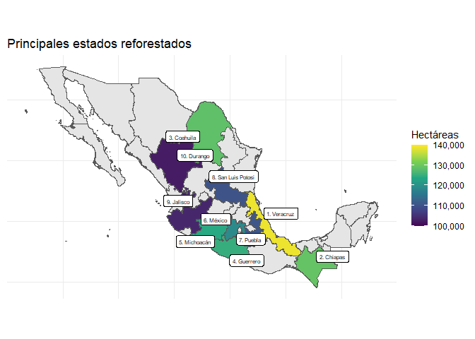

Trabajo 1
================

He creado este repositorio para compartir datos, el proceso, su análisis
y figuras. Siéntanse libres de analizarlo, replicarlo, corregirlo,
mejorarlo o lo que ustedes quieran. Una diferencia con el que
compartieron es que yo tomé la serie de tiempo desde el primer año, me
pareció que es una diferencia significativa y es necesario tomarla en
cuenta.

## Carga y preparación de datos

``` r
library(tidyverse)
```

    ## -- Attaching packages --------------------------------------- tidyverse 1.3.0 --

    ## v ggplot2 3.3.3     v purrr   0.3.4
    ## v tibble  3.0.6     v dplyr   1.0.4
    ## v tidyr   1.1.2     v stringr 1.4.0
    ## v readr   1.4.0     v forcats 0.5.1

    ## -- Conflicts ------------------------------------------ tidyverse_conflicts() --
    ## x dplyr::filter() masks stats::filter()
    ## x dplyr::lag()    masks stats::lag()

``` r
library(DataEditR)
library(magrittr)
```

    ## 
    ## Attaching package: 'magrittr'

    ## The following object is masked from 'package:purrr':
    ## 
    ##     set_names

    ## The following object is masked from 'package:tidyr':
    ## 
    ##     extract

``` r
library(gghighlight)
library(ggrepel)
library(scales)
```

    ## 
    ## Attaching package: 'scales'

    ## The following object is masked from 'package:purrr':
    ## 
    ##     discard

    ## The following object is masked from 'package:readr':
    ## 
    ##     col_factor

``` r
library(patchwork)
library(sf)
```

    ## Linking to GEOS 3.8.0, GDAL 3.0.4, PROJ 6.3.1

``` r
library(fuzzyjoin)

mx <- st_read("mx.gpkg",
              quiet = T) %>% 
  rename(entidad = 1)

mx$entidad <- as.character(fct_recode(mx$entidad,
                         "Coahuila" = "Coahuila De Zaragoza",
                         "Ciudad de México" = "Distrito Federal",
                         "México" = "Mexico",
                         "Michoacán" = "Michoacan ",
                         "Nuevo León" = "Nuevo Leon",
                         "Querétaro" = "Queretaro De Arteaga"
))

incendios <- read_csv('incendios mexico.csv')
```

    ## 
    ## -- Column specification --------------------------------------------------------
    ## cols(
    ##   `Entidad federativa` = col_character(),
    ##   `1991` = col_number(),
    ##   `1995` = col_number(),
    ##   `2000` = col_number(),
    ##   `2005` = col_number(),
    ##   `2010` = col_number(),
    ##   `2011` = col_number(),
    ##   `2012` = col_number(),
    ##   `2013` = col_number(),
    ##   `2014` = col_number(),
    ##   `2015` = col_number(),
    ##   `2016` = col_number(),
    ##   `2017` = col_number(),
    ##   `2018` = col_number(),
    ##   `2019` = col_number(),
    ##   `2020` = col_number()
    ## )

``` r
reforestaciones <- read_csv('reforestacion.csv') 
```

    ## 
    ## -- Column specification --------------------------------------------------------
    ## cols(
    ##   `Entidad federativa` = col_character(),
    ##   `1993` = col_number(),
    ##   `1995` = col_number(),
    ##   `2000` = col_number(),
    ##   `2005` = col_number(),
    ##   `2010` = col_number(),
    ##   `2011` = col_number(),
    ##   `2012` = col_number(),
    ##   `2013` = col_number(),
    ##   `2014` = col_number(),
    ##   `2015` = col_number(),
    ##   `2016` = col_number(),
    ##   `2017` = col_number(),
    ##   `2018` = col_number(),
    ##   `2019` = col_number()
    ## )

``` r
incendios$`Entidad federativa` <- fct_recode(incendios$`Entidad federativa`,
                                             "Ciudad de México" = "Ciudad de Méxic",
                                             "México" = "Méxic",
                                             "Michoacán" = "Michoacá",
                                             "Nuevo León" = "Nuevo Leó",
                                             "Querétaro" = "Querétar",
                                             "Yucatán" = "Yucatá"
)

reforestaciones$`Entidad federativa` <- fct_recode(reforestaciones$`Entidad federativa`,
                                             "Ciudad de México" = "Ciudad de Méxic",
                                             "México" = "Méxic",
                                             "Michoacán" = "Michoacá",
                                             "Nuevo León" = "Nuevo Leó",
                                             "Querétaro" = "Querétar",
                                             "Yucatán" = "Yucatá"
)


incendios <- incendios %>% 
  rename(entidad = 1) %>% 
  filter(entidad != 'Nacional') %>% 
  pivot_longer(!c(entidad), 
               names_to = 'año',
               values_to = 'superficie') %>% 
  mutate(año = parse_number(año)) %>% 
  group_by(entidad) %>% 
  mutate(acumulado = cumsum(superficie),
         t = año - lag(año),
         cociente = superficie  / lag(superficie),
         a = cociente ^ (1/t),
         tasa = round(a - 1, 2)) %>% 
  mutate(tipo = 'incendios',
         entidad = as.character(entidad)) %>% 
  select(!t:a)
  
reforestaciones <- reforestaciones %>% 
  rename(entidad = 1) %>% 
  filter(entidad != 'Nacional') %>% 
  pivot_longer(!c(entidad), names_to = 'año', values_to = 'superficie') %>% 
  mutate(año = parse_number(año)) %>% 
  group_by(entidad) %>% 
  mutate(acumulado = cumsum(superficie),
         t = año - lag(año),
         cociente = superficie  / lag(superficie),
         a = cociente ^ (1/t),
         tasa = round(a - 1, 2)) %>% 
  mutate(tipo = 'incendios',
         entidad = as.character(entidad)) %>% 
  select(!t:a)
```

## Preparación de figuras

``` r
superficie_incendios <- ggplot(incendios, aes(año, acumulado, color = entidad)) +
  geom_line(size = 2) +
  geom_point(size = 3) +
  gghighlight(max(acumulado),
              max_highlight = 10, 
              use_direct_label = F,
              unhighlighted_params = list(alpha = 0.3)) +
  facet_wrap(~fct_reorder(entidad, acumulado, .fun = max, .desc = T))+
  theme_minimal() +
  scale_y_continuous(labels = comma) +
  labs(x = 'Año', 
       y = 'Hectáreas',
       title = 'Superficie afectada por incendios (1990 - 2010)') +
  theme(legend.position = 'none',
        axis.text.x = element_text(angle = 45)) +
  scale_x_continuous(breaks = seq(1990, 2020, 4),
                     labels = seq(1990, 2020, 4))
superficie_incendios
```

<!-- -->

``` r
superficie_reforestaciones <- ggplot(reforestaciones, aes(año, acumulado, color = entidad)) +
  geom_line(size = 2) +
  geom_point(size = 3) +
  gghighlight(max(acumulado), 
              max_highlight = 10,
              use_direct_label = F,
              unhighlighted_params = list(alpha = 0.3)) +
  facet_wrap(~fct_reorder(entidad, acumulado, .fun = max, .desc = T))+
  theme_minimal() +
  scale_y_continuous(labels = comma, limits = c(0, 150000)) +
  labs(x = 'Año', 
       y = 'Hectáreas',
       title = 'Superficie reforestada (1993 - 2020)') +
  theme(legend.position = 'none',
        axis.text.x = element_text(angle = 45)) +
  scale_x_continuous(breaks = seq(1993, 2020, 4),
                     labels = seq(1993, 2020, 4))

superficie_reforestaciones
```

<!-- -->

## Mapas

``` r
incendios_espacial <- left_join(mx, incendios) %>% 
  filter(año == 2020) 
```

    ## Joining, by = "entidad"

``` r
reforestaciones_espacial <- left_join(mx, reforestaciones) %>% 
  filter(año == 2019)
```

    ## Joining, by = "entidad"

``` r
mapa_incendios <- ggplot() +
  geom_sf(data = mx) +
  geom_sf(data = incendios_espacial %>% 
            arrange(desc(acumulado)) %>% 
            slice_max(order_by = acumulado, n = 10), 
          aes(fill = acumulado)) +
  scale_fill_viridis_c(limits = c(0, 600000),
                       breaks = seq(100000, 600000, 100000),
                       labels = comma) +
  geom_sf_label(data = incendios_espacial %>% 
                  arrange(desc(acumulado)) %>% 
                  slice_max(order_by = acumulado, n = 10),
                aes(label = paste0(1:10, '. ', entidad)),
                size = 2) +
  theme_minimal() +
  theme(axis.text = element_blank()) +
  labs(x = NULL,
       y = NULL,
       fill = 'Hectáreas',
       title = 'Principales estados afectados por incendios')

mapa_reforestacion <- ggplot() +
  geom_sf(data = mx) +
  geom_sf(data = reforestaciones_espacial %>% 
            arrange(desc(acumulado)) %>% 
            slice_max(order_by = acumulado, n = 10), 
          aes(fill = acumulado)) +
  scale_fill_viridis_c(limits = c(100000, 140000),
                       breaks = seq(100000, 140000, 10000),
                       labels = comma) +
  geom_label_repel(data = reforestaciones_espacial %>% 
                  arrange(desc(acumulado)) %>% 
                  slice_max(order_by = acumulado, n = 10),
                aes(label = paste0(1:10, '. ', entidad),
                    geometry = geom),
                size = 2,
                stat = 'sf_coordinates') +
theme_minimal() +
theme(axis.text = element_blank()) +
labs(x = NULL,
     y = NULL,
     fill = 'Hectáreas',
     title = 'Principales estados afectados reforestados')

mapa_incendios
```

    ## Warning in st_point_on_surface.sfc(sf::st_zm(x)): st_point_on_surface may not
    ## give correct results for longitude/latitude data

<!-- -->

``` r
mapa_reforestacion
```

    ## Warning in st_point_on_surface.sfc(sf::st_zm(x)): st_point_on_surface may not
    ## give correct results for longitude/latitude data

<!-- -->
